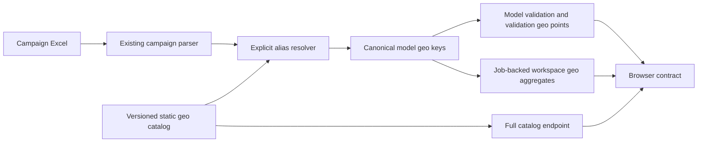

# Backend Phase E.1C: Canonical Geo Catalog V1

## Outcome

Phase E.1C turns the E.1A geo identity boundary into a complete static map-data
boundary. Backend now publishes reviewed coordinates for all active turnover
serving geographies, normalizes explicit aliases and preserves every unknown
geography and ruble without guessing.

No MMM, forecast, optimizer, Scenario 6, recommendation, React rendering or
deployment logic changed.

## End-to-end data path



The browser receives finished identities, coordinates, coverage and money. It
does not call a geocoder, aggregate job history or infer a location.

## Static data

| Item | Value |
|---|---|
| Catalog path | `04_Web_app/data/geo_catalog/geo_catalog_v1.csv` |
| Alias path | `04_Web_app/data/geo_catalog/geo_aliases_v1.csv` |
| Catalog version | `geo_catalog_v1_2026_07_18` |
| Canonical geographies | 220 |
| Alias rows | 402 |
| Coordinate system | WGS84 point latitude/longitude |
| Coordinate source | GeoNames Russia dump `RU.zip`, 2026-07-18 |
| Snapshot SHA-256 | `e900a407f811b53a1bf51612fe6f1a809af275e43a02b85f63c7bfddd75e4035` |
| License | Creative Commons Attribution 4.0 |
| Review status | `reviewed_static` |

Source and attribution details are in
`04_Web_app/data/geo_catalog/README.md`.

## Identity and alias semantics

`geo_id` remains the existing E.1A hash identity of the normalized serving
label. Phase E.1C does not renumber geographies.

Normalization performs only:

- trim and repeated-whitespace collapse;
- case normalization;
- `Ё` -> `Е`;
- Unicode hyphen -> ASCII hyphen;
- exact lookup in the versioned alias table.

Canonical and registered aliases return one canonical ID and coordinate pair.
Campaign preparation sends the package-compatible uppercase model key, such as
`МОСКВА`, into model validation while browser payloads use the catalog display
label `Москва`. The original input, for example `г. Москва`, remains in the
normalization evidence.

Unknown and ambiguous values return a deterministic input-derived ID, null
coordinates, and explicit evidence:

```json
{
  "input_geo_name": "Неизвестное гео",
  "canonical_geo_id": null,
  "canonical_geo_display_name": null,
  "normalization_status": "unknown",
  "normalization_rule": "no_registered_alias"
}
```

There is no fuzzy fallback.

Unknown coordinates do not by themselves turn file validation into an error.
The row and its money remain visible in `map_coverage`. Independently, the model
support policy can still block job creation when that geography has no serving
estimate; the map layer never overrides the model's allowed-use decision.

## Endpoint behavior

### `GET /api/v1/meta/geo-catalog`

Returns the complete 220-row catalog, source/license metadata and coverage.
Current active response is `available` with 220 located and zero unlocated
geographies.

### `GET /api/v1/validations/{validation_id}/view-v2`

Each `geo_points[]` row contains canonical identity, coordinates, region,
input/normalization evidence, budget/share, approved channel identities and
model-limitation count. `map_coverage` reconciles located/unlocated counts and
money.

Invariants:

- `sum(geo_points[].budget_rub) = requested_budget_rub` within one ruble;
- shares use the requested campaign budget and reconcile to one when positive;
- `geo_points.length = file_validation.geographies_n`;
- no unknown row is dropped.

### `GET /api/v1/workspace/geo-budget`

Reads only validations referenced by persisted jobs, resolves every preview geo
and groups budget by canonical `geo_id`. Repeated references to the same
`validation_id` are ignored, while independently uploaded campaigns with the
same display name remain separate records. Alias rows merge. One campaign is
counted once per geo even when its source contains repeated channel rows. The
response publishes total budget, per-geo money/share/campaign count and explicit
coverage.

## Contract transition

The task fixes `geo_catalog_v1` and `workspace_geo_budget_v1` at `1.0.0` and
`validation_result_v2` at `2.0.0`. Before E.1C these were repository-only pilot
skeletons with null coordinates; E.1C finalizes those reserved contracts and
updates backend schemas, generated TypeScript and the fail-closed client in one
release. This transition therefore requires an atomic backend/frontend deploy.
After E.1C, any breaking wire change requires a new contract version rather than
adding required fields under the same version.

## Coverage states

| Status | Meaning |
|---|---|
| `available` | Every returned geography has reviewed canonical coordinates. |
| `partial` | Known and unknown geographies coexist; all rows and budget are returned. |
| `unavailable` | No returned geography has coordinates, including an empty workspace. |

For budget-bearing responses coverage includes `located_budget_rub`,
`unlocated_budget_rub` and `unlocated_budget_share`.

## Active serving guard

Backend preflight loads `historical_support_bounds.csv`, selects
`scope=geo` and `target=turnover_per_user`, and checks the result against the
static catalog. On the current package:

- support rows read: 10,441;
- distinct active turnover-serving geographies: 220;
- canonical coordinates: 220;
- missing: 0;
- guard status: `available`.

Any missing serving geography fails preflight instead of disappearing from map
data.

## Real control-campaign acceptance

The exact `campaign-plan-example-regions-2026.xlsx` file was read through the
existing web campaign parser and canonical normalizer. No forecast or optimizer
calculation was rerun for this phase.

| Check | Result |
|---|---:|
| Parsed rows | 45 |
| Parse issues | 0 |
| Campaigns | 1 |
| Geographies | 15 |
| Channels | 3 |
| Requested budget | 267,818,706 RUB |
| Validation geo points | 15 |
| Canonical coordinate coverage | 15/15 |
| Validation budget/share | 267,818,706 RUB / 1.0 |
| Workspace rows | 15 |
| Workspace budget/share | 267,818,706 RUB / 1.0 |
| Unlocated budget | 0 RUB |
| Truncated machine strings | 0 |

Geographies were Волгоград, Воронеж, Краснодар, Красноярск, Новосибирск,
Омск, Ростов-на-Дону, Самара, Санкт-Петербург, Саратов, Тюмень, Уфа,
Чебоксары, Челябинск and Ярославль.

## Security and non-goals

- API payloads contain no local paths, hostnames or source SQL;
- no browser or runtime network call resolves geography;
- coordinates are marker points, not campaign-boundary polygons;
- no map UI, tile provider, static GeoJSON boundary or frontend aggregation is
  introduced here;
- source/license approval for a future map base remains a frontend/product
  decision.

## Regression results

- web/backend: 155 tests, `OK`, 12 explicit environment/evidence skips;
- real active-package acceptance: registered alias reaches model support and an
  unsupported unknown geo retains its row and 500,000 RUB in `partial` map
  evidence while job creation remains blocked by model policy;
- MMM core: 85 tests, `OK`, two fixture skips;
- generated TypeScript: deterministic and union-safe for canonical/unavailable
  coordinate states;
- TypeScript and ESLint: passed;
- frontend unit tests: 463/463 passed;
- production build: passed; the existing large-chunk advisory remains
  non-blocking.
