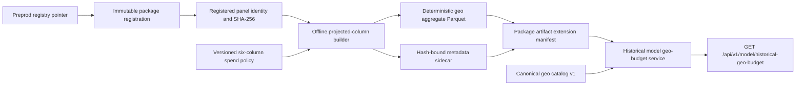

# Backend Phase E.1E: Historical Model Geo Budget V1

## Outcome

Phase E.1E introduces the browser-safe source for the Home map's intended
business meaning: historical advertising spend in the data of the selected
model. It does not replace calculation history and does not alter campaign
validation, MMM, forecast, optimizer, Scenario 6, recommendation policy,
frontend rendering or deployment.

## End-to-end data path



The long-lived HTTP process reads the small metadata aggregate and verifies its
Parquet hash. It does not read the full panel and does not need PyArrow at
runtime.

## Source resolution

The builder accepts `project_root`, `registry_root` and `package_id`. It reads
the package registration, verifies `registration_content_sha256`, resolves the
recorded panel path relative to the project root, then verifies source size and
SHA-256 before aggregation. `/mnt/data` and workstation paths are not encoded
in source or browser contracts.

The accepted source metadata was checked locally from Parquet metadata and
column projection:

| Check | Result |
|---|---:|
| Source rows | 308,886 |
| Source columns | 109 |
| Row groups | 1 |
| Model geographies | 220 |
| Period start | 2025-01-01 |
| Period end | 2026-05-31 |
| Positive-spend source rows | 250,584 |
| Zero-spend source rows | 58,302 |
| Null / infinite / negative selected spend values | 0 / 0 / 0 |

Exact financial totals, per-channel totals and ranking remain in ignored local
acceptance evidence under the package-artifact store. They are intentionally
not committed to the external repository under the project company-data rule.
The acceptance did verify exact equality between the selected source-column
sum, aggregate total and sum of all 220 published rows.

## Spend policy

The source-of-truth policy is
`02_Code/01_PyMC/configs/historical_geo_budget_spend_columns_v1.json`.
Only these columns are selected:

1. `spend_Digital_Performance`
2. `spend_OOH_Total`
3. `spend_Indoor`
4. `spend_Радио`
5. `spend_Нац_ТВ`
6. `spend_Рег_ТВ`

`spend_OOH` and `spend_ООН_РТБ` are explicitly forbidden when
`spend_OOH_Total` is selected. This prevents OOH double counting. The builder
does not search for columns by prefix and does not infer new channels.

## Metric semantics

| Field | Meaning |
|---|---|
| `historical_total_budget_rub` | Sum of the six approved spend columns for one model geography over the full panel period. |
| `active_days_n` | Distinct geography dates with strictly positive combined approved spend. |
| `active_rows_n` | Source rows for that geography with strictly positive combined approved spend. |
| `budget_share` | Geography historical spend divided by the full selected historical spend. |
| `source_rows_n` | Number of source panel rows represented by the artifact row. |

`active_rows_n` and `active_days_n` are activity evidence, not campaign counts.
No campaign count is present in the artifact or HTTP contract.

## Artifact contract

The builder writes:

```text
03_Outputs/01_PyMC_outputs/00_Model_registry/
  package_artifacts/<package_id>/
    package_artifacts_manifest_v1.json
    historical_geo_budget_v1/
      historical_geo_budget_v1.parquet
      historical_geo_budget_v1.metadata.json
      historical_geo_budget_v1.build.json
```

The Parquet and metadata are immutable and deterministic for the same package,
source, policy and `generated_at_utc`. The manifest binds:

- package ID and package input fingerprint;
- registration-content and source-panel hashes;
- artifact ID, version, relative path, SHA-256 and size;
- metadata relative path and SHA-256.

The metadata also records source schema counts, period, selected columns,
policy hash, row counts, totals and deterministic row order. The build card is
operational evidence and records elapsed time and observed peak process RSS.

The existing registered package inventory is not rewritten. This additive
extension is deliberate: changing the old model directory or registration
after promotion would invalidate model-package immutability.

## Build command

```bash
python -B 02_Code/01_PyMC/mmm_core/historical_geo_budget.py \
  --project-root <project-root> \
  --registry-root <project-root>/03_Outputs/01_PyMC_outputs/00_Model_registry \
  --package-id <registered-package-id> \
  --config 02_Code/01_PyMC/configs/historical_geo_budget_spend_columns_v1.json \
  --generated-at-utc <reviewed-utc-timestamp>
```

The builder reads only eight projected columns in batches. It does not train,
score or refit a model.

## Endpoint

`GET /api/v1/model/historical-geo-budget` requires `model.read` and returns
`historical_model_geo_budget_v1`.

The response contains package/artifact identities, period, total, canonical
coverage and 220 geo rows. Each row contains canonical ID and display name,
reviewed coordinates or explicit nulls, historical budget/share and activity
days/rows. It contains no local path, source SQL, host name or stack trace.

Coverage semantics:

| Status | Meaning |
|---|---|
| `available` | Every artifact geography has a canonical coordinate. |
| `partial` | Located and unlocated geographies coexist; all money remains published. |
| `unavailable` | No geography can be located, or an old package has no aggregate artifact. |

The current local acceptance is `available`: 220/220 canonical coordinates,
zero unlocated budget and exact total reconciliation. Synthetic regression
tests also prove `partial`, all-unlocated, old-package, alias-collision and
tamper behavior.

## Workspace distinction

The two contracts must never be substituted silently:

| Contract | Business meaning | Intended screen |
|---|---|---|
| `workspace_geo_budget_v1` | Budgets from campaigns processed by the application. | Calculation history or workspace analytics. |
| `historical_model_geo_budget_v1` | Actual approved media spend columns in the registered model panel. | Home historical model map after Phase E.1F. |

Campaign upload continues to use validation `view-v2` geo points. Phase E.1E
does not change campaign-map semantics.

## Performance acceptance

Local acceptance on the registered panel produced:

| Measure | Result |
|---|---:|
| Final build time | 0.686 s |
| Peak process RSS observed | 198,246,400 bytes |
| Aggregate Parquet size | 11,172 bytes |
| Metadata sidecar size | 121,342 bytes |
| Browser payload sample size | 81,023 bytes |
| Payload assembly, first call | 5.30 ms |
| Payload assembly, warm call | 2.54 ms |

These measurements are workstation observations, not a server SLA. Most
importantly, endpoint assembly did not open the 308,886 x 109 source panel.

## Repository and data policy

Code, schemas, synthetic fixtures and reproducible build instructions are
committed. The source panel, real aggregate Parquet, real metadata/sample and
exact financial ranking remain ignored local package evidence. This preserves
the external repository's source-only boundary.

The package artifact extension is not yet added to the research-pilot transfer
bundle because deployment is explicitly out of scope for Phase E.1E. A server
without the extension returns controlled `unavailable`; it never falls back to
workspace history.

## Regression boundary

The phase adds tests for:

- exact six-column policy and OOH overlap rejection;
- source schema, null, infinite, negative and missing-column failures;
- period, geo/global reconciliation, activity counts and shares;
- deterministic Parquet, metadata and package extension manifest;
- registry-bound path, size and hash verification;
- available, partial, unavailable, tampered and duplicate-alias serving;
- schema/OpenAPI discovery, HTTP query rejection and browser-safe `503`;
- generated TypeScript and unchanged frontend type/build behavior.

Local final-code results:

- web/backend: 161 tests, 149 passed, 12 explicit external-evidence skips;
- MMM core: 91 tests, 89 passed, two external-fixture skips;
- generated contract output: deterministic after production-build regeneration;
- TypeScript and ESLint: passed;
- frontend unit/component tests: 483/483 passed;
- production build: passed with the pre-existing large-chunk advisory.

GitHub CI evidence is frozen in `CURRENT_TRUTH.md` after the PR head is green.
